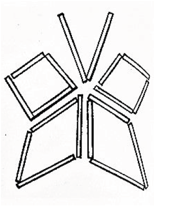
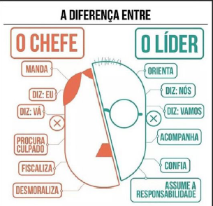

# Liderança
#### Formação para articuladores

- **Tempo**: 02 horas
- **Participantes**:  Articuladores de célula
- **Materiais**: Projetor, papéis A4, canetas

## Procedimentos

### ❶ DINÂMICA QUEBRA GELO 

Será utilizada uma caixa de fósforos para a execução da dinâmica.
Dependendo do número de participantes, as equipes serão formadas com, no mínimo 4
pessoas em cada grupo. Sendo escolhido um integrante para ser o líder (sem o chamar
assim, de início, até que a dinâmica termine).
O desenho abaixo será apresentado aos líderes e cada equipe, apenas, e cada uma delas
terá palitos de fósforo distribuídos.
Sem falar e com as mãos para trás, o líder terá que observar o desenho e orientar os demais participantes de sua equipe a fazer o mais parecido possível, podendo quebrar os palitos, se desejar e observar os desenho quantas vezes desejar, indo ao encontro da amostra e voltando para o local onde se encontra a equipe.
As equipes terão 5 a 7 minutos para fazer o desenho completo e pausar quando o tempo
acabar ou alguma equipe terminar.
Ao final, será apresentado o modelo e comparado com os feitos da equipe. Será analisado o processo de trabalho em equipe e a qualidade e preocupação do líder para a mesma.
Reconhecer a importância do trabalho do líder e como cooperar e confiar em suas escolhas, podendo ajudar sempre que necessário e tornar o trabalho eficaz. 

### ❷ ASSISTINDO O VÍDEO
Video de LoL sobre Liderança https://www.youtube.com/watch?v=eKjX9sRU7x8&amp  
Pedir para que os participantes da interação possam comentar e perceber semelhanças entre o líder do jogo e um líder em situações reais.
Pedir também para que cada membro cite um exemplo onde se passou por uma situação de liderança (ou viu alguém exercendo essa função).

### ❸ DISCUSSÃO
Os articuladores da reunião deverão apresentar uma breve introdução da diferença entre um líder e um chefe. A imagem a seguir os orienta. 

### ❹ ANÁLISE
Os articuladores deverão distribuir para os participantes [Anexo 1](ANEXO 1.pdf): Como ser um líder sem chatear seus integrantes.

### ❺ COLOCANDO EM PRÁTICA 
Dividir em 2 grupos, o primeiro grupo vai falar um exemplo de liderança positiva e o grupo 2 um exemplo de liderança negativa.

###  PROCESSAMENTO EM GRUPO

